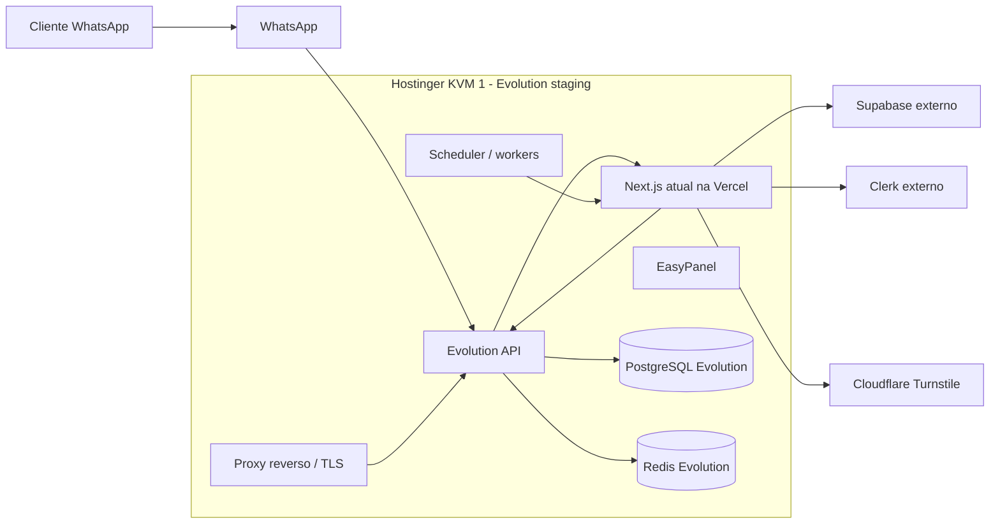
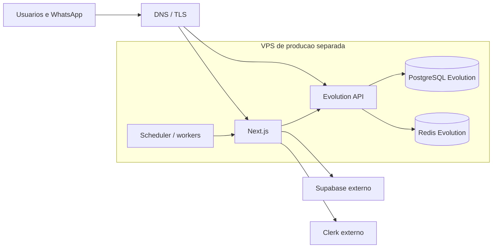

# KAN-127 - Baseline de infraestrutura Hostinger

## Objetivo

Registrar a infraestrutura contratada, a arquitetura alvo e os limites de
capacidade antes de instalar EasyPanel, Evolution API ou migrar o aplicativo.
Este documento e a referencia de entrada para as KAN-128 a KAN-138.

O baseline foi levantado em 28/09/2026 por consulta somente leitura ao MCP
oficial da Hostinger e por inventario do repositorio. Nenhum segredo, senha,
token ou telefone real deve ser adicionado a este documento.

## Decisao executiva

A VPS atual fica aprovada para laboratorio de QA/staging da infraestrutura e
para validar uma instancia Evolution. Ela nao fica aprovada para producao
completa nem para hospedar staging e producao ao mesmo tempo.

Antes de clientes reais ou da migracao do app, a operacao deve provisionar uma
VPS separada, preferencialmente no Brasil, com capacidade recomendada de 4 vCPU,
16 GB de RAM e 150-200 GB NVMe. O minimo para um piloto controlado e 2 vCPU,
8 GB de RAM e 100 GB de disco.

## Inventario real da VPS

| Item | Valor validado |
| --- | --- |
| Provedor | Hostinger |
| Plano | KVM 1 |
| Estado | `running` |
| Regiao | Estados Unidos, Boston |
| Sistema operacional | Ubuntu 26.04 LTS |
| CPU | 1 vCPU |
| Memoria | 4 GB |
| Disco | 50 GB |
| Banda | 4 TB |
| Firewall Hostinger | Zero regras e nenhum grupo associado |
| Acesso administrativo atual | SSH como `root`; chave e restricao ainda nao validadas |
| Backup atual | Sem snapshot; agenda semanal exibida no painel |
| Protecao adicional | Detector de malware nao instalado |
| Uso aprovado | QA/staging da Evolution e integracao do bot |
| Uso reprovado | Producao completa ou app + staging + producao no mesmo host |

IDs, hostname, IPv4 e IPv6 permanecem no inventario protegido da Hostinger. Eles
nao sao necessarios no repositorio porque DNS e MCP fornecem a referencia
operacional.

## Topologia imediata de QA

Nesta etapa, o app continua na Vercel e a KVM 1 recebe somente a infraestrutura
de staging da Evolution e workers de baixo volume.

## Topologia futura apos gate de capacidade

Supabase continua sendo o banco de negocio do aplicativo. O PostgreSQL local
da Evolution atende somente a Evolution e nao substitui o Supabase. Clerk
continua sendo o provedor de autenticacao.

## Separacao de ambientes

### Staging e QA

- host atual KVM 1;
- uma instancia Evolution;
- PostgreSQL e Redis exclusivos da Evolution de staging;
- um numero autorizado de QA;
- rollout do bot restrito a lojas piloto;
- dados descartaveis, anonimizados e sem segredos de producao;
- projeto/instancia de desenvolvimento do Clerk;
- projeto Supabase de staging separado antes de hospedar o app completo;
- builds produzidos no CI, nunca compilados nesta VPS.

### Producao

- VPS separada e dimensionada antes do go-live;
- volumes, redes, bancos, Redis e secrets separados de staging;
- projeto/instancia de producao do Clerk;
- Supabase de producao externo;
- backups externos e monitoramento obrigatorios;
- staging nao pode compartilhar host, banco ou sessao WhatsApp com producao.

Projetos diferentes dentro do mesmo EasyPanel organizam recursos, mas nao
oferecem isolamento real quando dividem a mesma VPS.

## Dominios planejados

| Ambiente | Servico | Dominio planejado |
| --- | --- | --- |
| Staging | App | `staging.clicaepede.com.br` |
| Staging | Admin | `admin.staging.clicaepede.com.br` |
| Staging | Lojas/cardapios | `staging.clicaepede.com.br/cardapio/{storeSlug}` |
| Staging | Evolution | `evolution-staging.clicaepede.com.br` |
| Staging | EasyPanel | `ops-staging.clicaepede.com.br` |
| Producao | App | `clicaepede.com.br` |
| Producao | Admin | `admin.clicaepede.com.br` |
| Producao | Lojas/cardapios | `clicaepede.com.br/cardapio/{storeSlug}` |
| Producao | Evolution | `evolution.clicaepede.com.br` |
| Producao | EasyPanel | `ops.clicaepede.com.br` |

Os dominios de operacao devem exigir restricao adicional por IP, VPN ou camada
de autenticacao. A autoridade DNS atual deve ser confirmada na KAN-131 antes de
qualquer alteracao.

## Redes e portas

### Exposicao publica

| Porta | Uso | Regra |
| --- | --- | --- |
| 80/tcp | HTTP | Apenas redirecionamento para HTTPS |
| 443/tcp | Proxy reverso e TLS | Publica para app, webhook e Evolution |
| 22/tcp | SSH | Somente IPs administrativos autorizados |

### Rede privada de containers

| Porta | Servico | Publicar diretamente? |
| --- | --- | --- |
| 3000 | Next.js | Nao; somente atras do proxy |
| 8080 | Evolution, se mantido o padrao | Nao; somente atras do proxy |
| 5432 | PostgreSQL da Evolution | Nunca |
| 6379 | Redis da Evolution | Nunca |

EasyPanel, PostgreSQL e Redis nao podem ficar expostos diretamente na internet.
O proxy e a unica entrada para os servicos HTTP.

### Bloqueio de seguranca atual

O painel mostra SSH como `root`, zero regras de firewall, nenhum snapshot e
detector de malware ausente. Antes de instalar workloads ou persistir dados de
QA, a operacao deve:

1. cadastrar e validar uma chave SSH administrativa;
2. aplicar firewall permitindo somente 22 restrito, 80 e 443;
3. criar acesso administrativo nominal;
4. restringir login root por senha depois de validar o acesso alternativo;
5. confirmar atualizacoes de seguranca e protecao contra brute force.

Esse minimo de seguranca deve ser executado no inicio da KAN-130, antes da
instalacao operacional da KAN-129 continuar.

## Dependencias externas e variaveis

| Grupo | Staging | Producao |
| --- | --- | --- |
| App URL | `staging.clicaepede.com.br` | `clicaepede.com.br` |
| Admin prefix | `admin` | `admin` |
| Supabase | Projeto externo de staging | Projeto externo atual de producao |
| Clerk | Instancia de desenvolvimento | Instancia de producao |
| Turnstile | Chaves e hostnames de staging | Chaves e hostnames de producao |
| Evolution | URL/chaves exclusivas de staging | URL/chaves exclusivas de producao |
| Cron | Secret exclusivo de staging | Secret exclusivo de producao |
| Rollout WhatsApp | `pilot`, somente loja QA | `off` ate aceite do piloto |

Inventario de configuracao que deve ser migrado e validado por ambiente:

| Grupo | Variaveis |
| --- | --- |
| Dominio/app | `NEXT_PUBLIC_APP_DOMAIN`, `NEXT_PUBLIC_APP_URL`, `APP_URL`, `NEXT_PUBLIC_ADMIN_SUBDOMAIN` |
| Banco do app | `POSTGRES_URL`, `DATABASE_URL`, `DRIZZLE_DEBUG` |
| Seguranca interna | `PUBLIC_ORDER_SECURITY_SECRET`, `STORE_ACCESS_INVITE_SECRET`, `NEXT_SERVER_ACTIONS_ENCRYPTION_KEY` |
| Clerk | `NEXT_PUBLIC_CLERK_PUBLISHABLE_KEY`, `CLERK_SECRET_KEY` e todas as `NEXT_PUBLIC_CLERK_*_URL` |
| Supabase | `SUPABASE_URL`, `NEXT_PUBLIC_SUPABASE_URL`, `NEXT_PUBLIC_SUPABASE_ANON_KEY`, `SUPABASE_SERVICE_ROLE_KEY` |
| Turnstile | `NEXT_PUBLIC_TURNSTILE_SITE_KEY`, `TURNSTILE_SECRET_KEY`, `TURNSTILE_ALLOWED_HOSTNAMES` |
| WhatsApp/Evolution | `WHATSAPP_EVOLUTION_API_BASE_URL`, `WHATSAPP_EVOLUTION_API_KEY`, `WHATSAPP_EVOLUTION_WEBHOOK_SECRET` |
| LLM do bot | `WHATSAPP_ASSISTANT_LLM_API_KEY`, `OPENAI_API_KEY`, `WHATSAPP_ASSISTANT_LLM_URL`, `WHATSAPP_ASSISTANT_LLM_MODEL` |
| Rollout do bot | `WHATSAPP_BOT_ROLLOUT_MODE`, `WHATSAPP_BOT_PILOT_STORE_IDS` |
| Cron/workers | `CRON_SECRET`, `BILLING_INVOICE_LEAD_DAYS`, `BILLING_RECURRING_RUN_LIMIT` |
| Billing | `BILLING_GATEWAY_ALLOWED_PROVIDERS`, `BILLING_GATEWAY_WEBHOOK_SECRET` |
| Operacao interna | `INTERNAL_OPERATIONS_ROLLOUT_MODE`, `INTERNAL_OPERATIONS_PILOT_EMAILS`, `INTERNAL_OPERATIONS_PILOT_ROLES` |
| iFood | `NEXT_PUBLIC_IFOOD_CLIENT_ID`, `IFOOD_CLIENT_SECRET`, `IFOOD_REDIRECT_URI`, `IFOOD_TOKEN_ENCRYPTION_KEY`, `IFOOD_API_BASE_URL` |
| NFe | `NFE_IO_API_KEY` |
| PostHog | `NEXT_PUBLIC_POSTHOG_KEY`, `NEXT_PUBLIC_POSTHOG_HOST` |
| Impressao | `QZ_TRAY_PRIVATE_KEY` |

`VERCEL_URL` e `VERCEL_PROJECT_PRODUCTION_URL` nao devem ser transportadas para
a VPS. Elas precisam ser substituidas por `NEXT_PUBLIC_APP_URL`, `APP_URL` e
`NEXT_PUBLIC_APP_DOMAIN` canonicos. Variaveis `KAN116_*` sao exclusivas de teste
de integracao e nao fazem parte do runtime de producao.

Valores reais ficam somente no gerenciador de secrets do ambiente.

## Dependencias atuais da Vercel

O repositorio nao depende de pacote `@vercel/*`, mas a operacao atual depende da
plataforma nos seguintes pontos:

- deploy e runtime do Next.js;
- dominios e URLs geradas de preview/producao;
- variaveis e secrets por ambiente;
- cron diario `GET /api/cron/billing`, agendado em `vercel.json` para 09:00 UTC;
- logs e diagnostico de runtime;
- rollback/promocao de deployments.
- URLs permitidas, redirects e webhooks do Clerk;
- webhook de billing e secrets associados;
- redirect URI da integracao iFood;
- proxy/rewrite do PostHog configurado no Next.js;
- Supabase Storage e hostnames de imagens remotas;
- hostnames permitidos e chaves do Cloudflare Turnstile;
- callbacks e URLs publicas geradas para pedido, convite e WhatsApp.

A rota `GET /api/cron/whatsapp/transactional` existe, mas nao esta no
`vercel.json` porque o plano Hobby nao permite a frequencia curta necessaria.
Ela deve migrar para scheduler/worker autenticado na KAN-135.

## Estimativa de capacidade

Os numeros abaixo sao uma estimativa inicial, nao um benchmark. O envelope de
QA assume uma instancia WhatsApp, uma loja piloto, ate 100 mensagens por hora,
sem LLM, retencao curta de logs e nenhum build executado na VPS. O envelope de
producao recomendado assume piloto de ate tres lojas/instancias, uma replica do
app e ate 30 mensagens por minuto no agregado. Crescimento alem desse envelope
exige teste de carga e novo dimensionamento; ele nao cobre a meta futura de 60
clientes.

| Componente | Faixa de RAM esperada |
| --- | --- |
| Ubuntu, Docker e EasyPanel | 0,7-1,0 GB |
| Evolution API | 0,5-1,2 GB |
| PostgreSQL Evolution | 0,5-1,0 GB |
| Redis Evolution | 0,1-0,3 GB |
| Next.js | 0,5-1,5 GB |
| Proxy, workers e monitoramento | 0,3-0,8 GB |

A soma pode ultrapassar 4 GB durante build, pico de mensagens, manutencao do
banco ou otimizacao de imagens. Por isso:

- KVM 1: somente staging/QA e baixo volume;
- build do Next.js: obrigatoriamente no CI;
- producao piloto recomendada: 4 vCPU, 16 GB e 150-200 GB NVMe;
- producao piloto minima: 2 vCPU, 8 GB e 100 GB, sujeita a benchmark;
- producao deve preferir regiao brasileira para reduzir latencia.

## Gates obrigatorios de upgrade

O upgrade ou uma VPS de producao separada torna-se obrigatorio antes da migracao
do app. Tambem deve ser antecipado se qualquer condicao ocorrer:

- CPU acima de 60% por 15 minutos;
- memoria acima de 70% continuamente;
- qualquer OOM ou reinicio por falta de memoria;
- uso continuo de swap;
- disco acima de 70% ou esgotamento previsto em menos de 30 dias;
- mais de uma instancia WhatsApp;
- fila atrasada por mais de 60 segundos;
- latencia p95 de processamento acima de 5 segundos;
- staging e producao precisarem operar simultaneamente.

## RPO, RTO e backup

| Ambiente | RPO | RTO | Politica minima |
| --- | --- | --- | --- |
| Staging/QA | 24 horas | 8 horas | Backup externo diario, retencao de 7 dias e restauracao antes do QA final |
| Producao | 1 hora | 4 horas | PITR/WAL continuo ou backup logico horario, destino externo e retencao de 30 dias |

Snapshots da VPS nao substituem backup logico. Nenhum backup primario pode
ficar somente no mesmo disco da aplicacao. Infra/DevOps responde pela execucao
e pelos alertas; uma restauracao deve ser testada trimestralmente e antes do
primeiro go-live.

## Responsabilidades

| Papel | Responsabilidade |
| --- | --- |
| Produto/Ops | Aprovar dominios, janela, numero QA e aceite funcional |
| Infra/DevOps | VPS, EasyPanel, DNS, TLS, firewall, backup e monitoramento |
| Engenharia | Containers, migrations, healthchecks, workers, webhooks e rollback |
| Seguranca | Acessos, secrets, rotacao e resposta a incidentes |
| QA | Jornada ponta a ponta, evidencias e limpeza dos dados de teste |

## Janela de manutencao

- janela regular: terca-feira, 02:00-04:00, horario de Brasilia;
- aviso minimo: 24 horas;
- mudanca produtiva exige backup e rollback preparados;
- incidentes criticos podem usar janela emergencial;
- Evolution e banco nao devem ser atualizados simultaneamente.

## Riscos aceitos e mitigacoes

| Risco | Mitigacao |
| --- | --- |
| Ponto unico de falha na KVM 1 | Usar somente em QA; producao separada |
| 1 vCPU atrasar webhooks/workers | Limites, alertas e gate de upgrade |
| Disco de 50 GB encher com logs/imagens | Retencao, limpeza e alerta em 70% |
| Regiao Boston aumentar latencia | Preferir Brasil na VPS de producao |
| Ubuntu 26.04 recente | Validar Docker, EasyPanel e backup antes do piloto |
| Mistura de ambientes | Redes, bancos, secrets e hosts separados |
| Perda de backup local | Copia externa e teste real de restauracao |
| Sessao Baileys desconectar | Healthcheck, alerta e fluxo de reconexao |

## Checklist de conclusao da KAN-127

- [x] Plano, regiao, CPU, RAM, disco e sistema operacional registrados.
- [x] Componentes e redes representados em diagrama.
- [x] Supabase e Clerk identificados como externos.
- [x] Producao e staging possuem nomes, dominios, variaveis e dados separados.
- [x] Endpoints, portas publicas e portas internas definidos.
- [x] Dependencias atuais da Vercel, incluindo crons, inventariadas.
- [x] RPO, RTO, responsaveis e janela de manutencao definidos.
- [x] Consumo estimado, margem e gates de upgrade registrados.

## Referencias

- [EasyPanel documentation](https://easypanel.io/docs)
- [Next.js self-hosting](https://nextjs.org/docs/app/guides/self-hosting)
- `docs/kan98-whatsapp-bot-architecture-runbook.md`
- `.env.example`
- `vercel.json`
